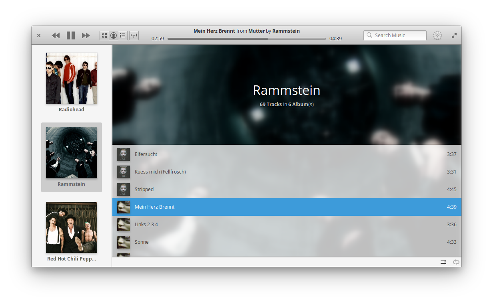
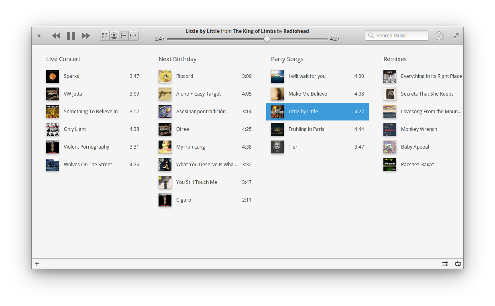
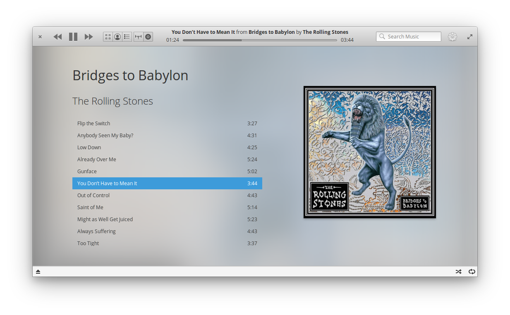

<div>
  <h1 align="center">Play My Music</h1>
  <h3 align="center">A music player for listening to local music files, online radios, and Audio CD's</h3>
  <p align="center">Designed for <a href="https://elementary.io"> elementary OS</p>
</div>
<p align="center">
  <a href="https://appcenter.elementary.io/com.github.artemanufrij.playmymusic">
    
  </a>
</p>

<br/>






## Donations
If you liked _Play My Music_, and would like to support it's development of this app and more, consider [buying me a coffee](https://www.paypal.me/ArtemAnufrij) :) 

## Install from Github.

As first you need elementary SDK
```
sudo apt install elementary-sdk
```

Install dependencies
```
sudo apt install libsoup2.4-dev
sudo apt install libsqlite3-dev
sudo apt install libgstreamer-plugins-base1.0-dev
```

Clone repository and change directory
```
git clone https://github.com/artemanufrij/playmymusic.git
cd playmymusic
```

Create **build** folder, compile and start application
```
mkdir build
cd build
cmake -DCMAKE_INSTALL_PREFIX=/usr ..
make
```

Install and start Play My Music on your system
```
sudo make install
com.github.artemanufrij.playmymusic
```
