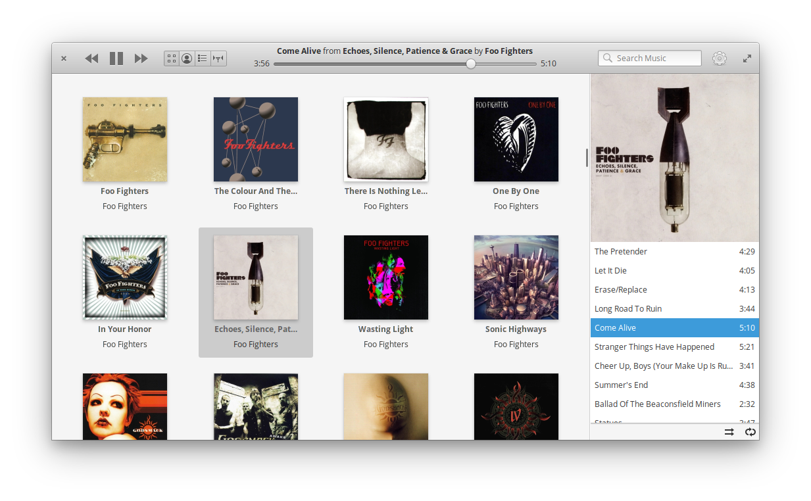

# [under development] Play My Music

### Play My Music is a simple player for listening local music files and online radio stations designed for [elementary OS](https://elementary.io)



## Install from Github.

As first you need elementary SDK
```
sudo apt install elementary-sdk
```

Install dependencies
```
sudo apt install libsoup2.4-dev
sudo apt install libsqlite3-dev
sudo apt install libgstreamer-plugins-base1.0-dev
```

Clone repository and change directory
```
git clone https://github.com/artemanufrij/playmymusic.git
cd playmymusic
```

Create **build** folder, compile and start application
```
mkdir
cd build
cmake -DCMAKE_INSTALL_PREFIX=/usr ..
make
```

Install and start Play My Music on your system
```
sudo make install
com.github.artemanufrij.playmymusic
```
