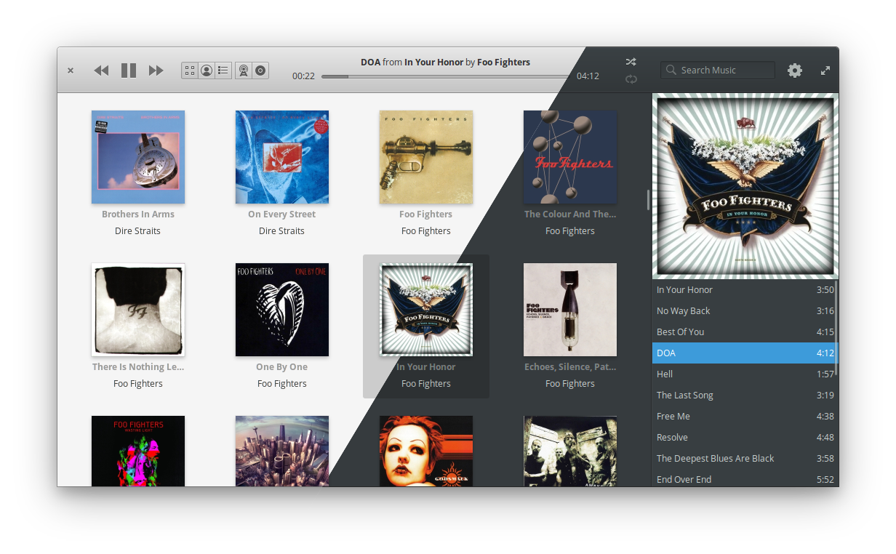
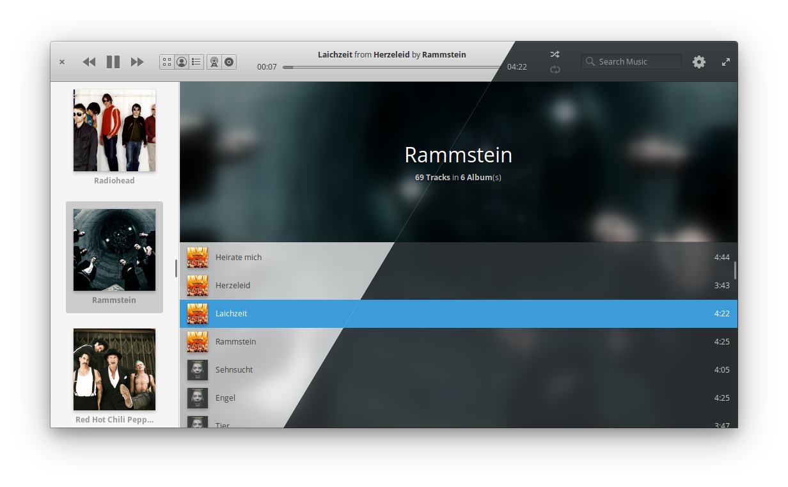
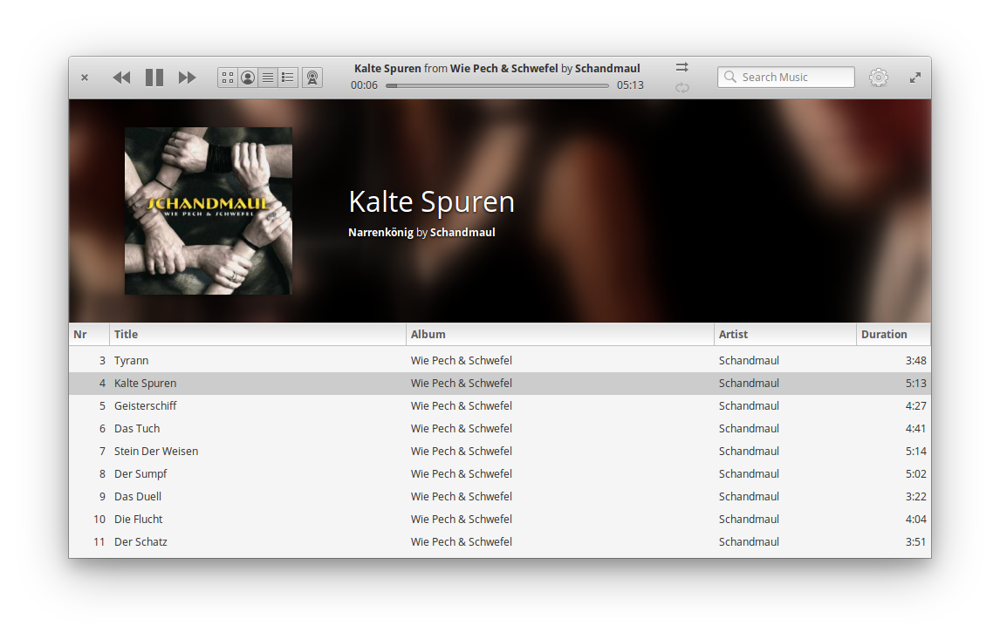

<div>
  <h1 align="center">Melody</h1>
  <h3 align="center"><br>A music player for listening to local music files, online radios, and Audio CD's</h3>
  <p align="center">Designed for <a href="https://elementary.io">elementary OS</a></p>
</div>

[](https://travis-ci.org/artemanufrij/playmymusic)

### Donate
<a href="https://www.paypal.me/ArtemAnufrij">PayPal</a> | <a href="https://liberapay.com/Artem/donate">LiberaPay</a> | <a href="https://www.patreon.com/ArtemAnufrij">Patreon</a>

<p align="center">
  <a href="https://appcenter.elementary.io/com.github.artemanufrij.playmymusic">
    
  </a>
  <a href="https://flathub.org/apps/details/com.github.artemanufrij.playmymusic">
    
  </a>
</p>

<br/>





## Install from Flatpak
Melody on Flathub: https://flathub.org/apps/details/com.github.artemanufrij.playmymusic

Install
```
flatpak install flathub com.github.artemanufrij.playmymusic
```

Run
```
flatpak run com.github.artemanufrij.playmymusic
```

## Install from Github.

As first you need elementary SDK
```
sudo apt install elementary-sdk
```

Install dependencies
```
sudo apt install libsoup2.4-dev libsqlite3-dev libgstreamer-plugins-base1.0-dev libtagc0-dev
```

Clone repository and change directory
```
git clone https://github.com/artemanufrij/playmymusic.git
cd playmymusic
```

Compile, install and start Melody on your system
```
meson build --prefix=/usr
cd build
sudo ninja install
com.github.artemanufrij.playmymusic
```
